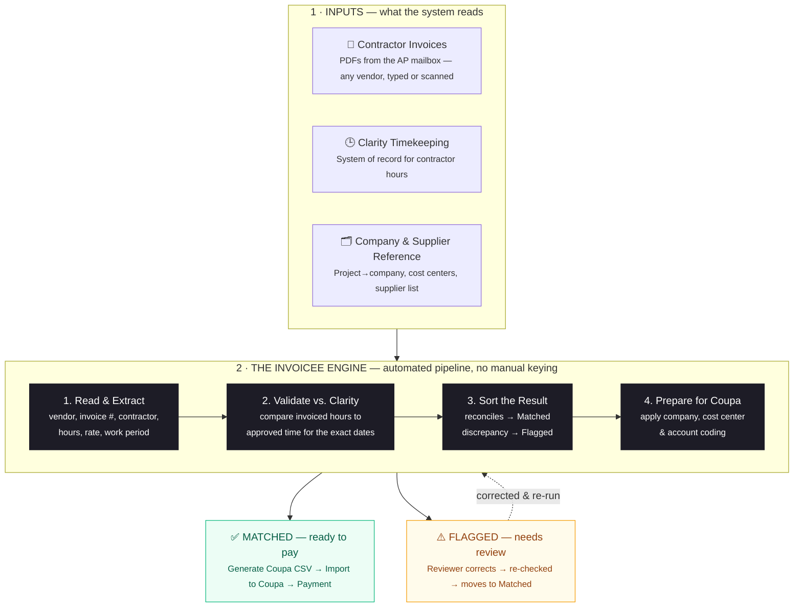

# InVoicee — Architecture & Process Overview

**Automated contractor invoice processing for Upbound Group Accounts Payable.**

InVoicee ingests contractor invoices, validates the billed hours against **Clarity** timekeeping,
separates clean invoices from exceptions, and prepares them for payment in **Coupa** — replacing a
manual, line-by-line review.

> An executive-ready one-page version is in **`InVoicee_Architecture.html`** — open it in any browser
> and use *Print → Save as PDF* to email it.

---

## How an invoice flows through the system

---

## What the operator sees

A single dashboard with three columns — **Flagged · Matched · All** — so every invoice is visible and
verifiable at a glance:

| Outcome | Meaning | Next step |
|---|---|---|
| 🟢 **Matched** | Billed hours reconcile to Clarity for the dates worked | One-click **Approve & Create CSV** → import to Coupa → payment |
| 🟡 **Flagged** | A name, hours, or amount doesn't match | The exact discrepancy is shown side-by-side with Clarity; reviewer corrects and re-runs |

---

## Why it matters

| | |
|---|---|
| **Faster** | Minutes of automated checking replace hours of manual reconciliation. |
| **Accurate** | Every billed hour is verified against the timekeeping system of record. |
| **Auditable** | Each invoice carries a full record of what was parsed, matched, and routed. |
| **Secure** | Runs entirely on internal data — **no third-party AI services**, and no data leaves the company. |

*Built local-first today (secure sandbox) and designed to connect directly to the mailbox, document
storage, and Coupa as it moves to production.*
